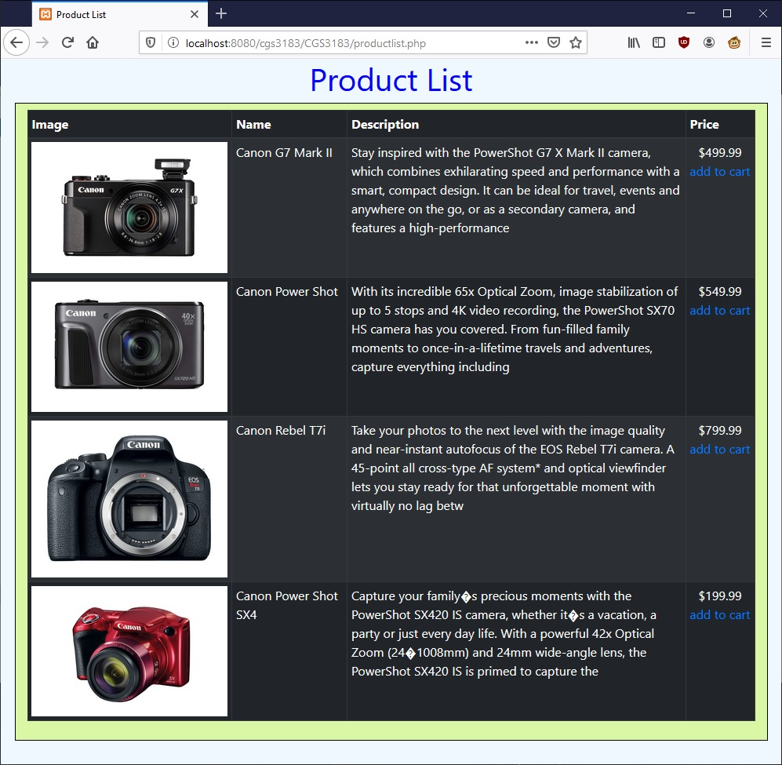
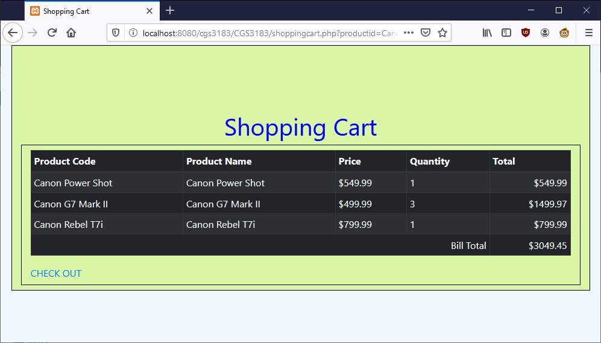
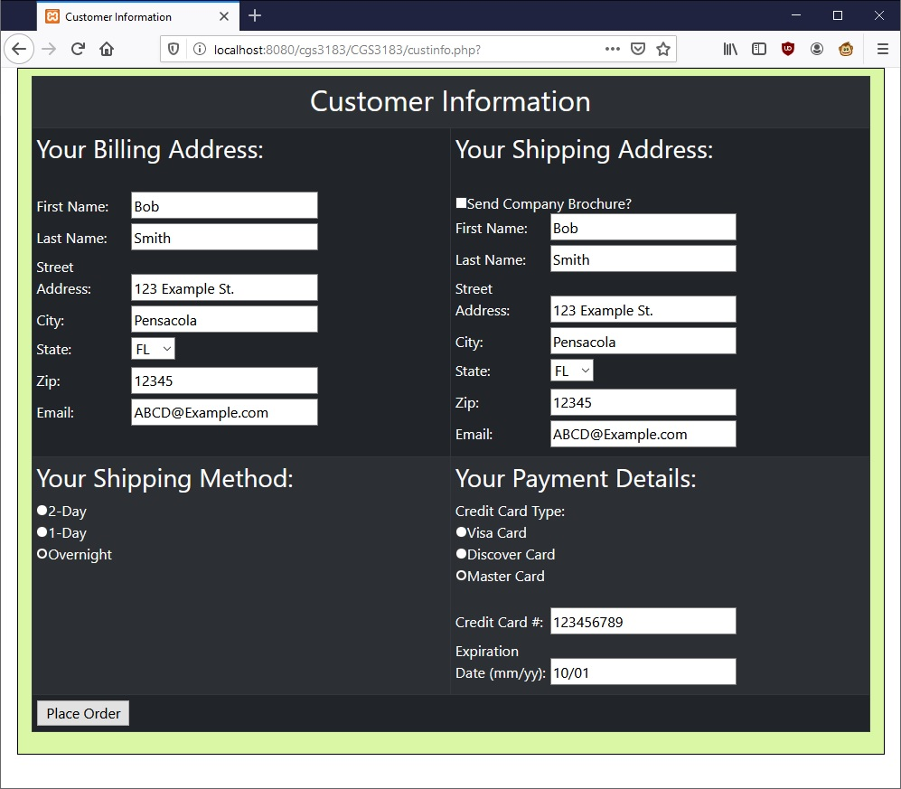
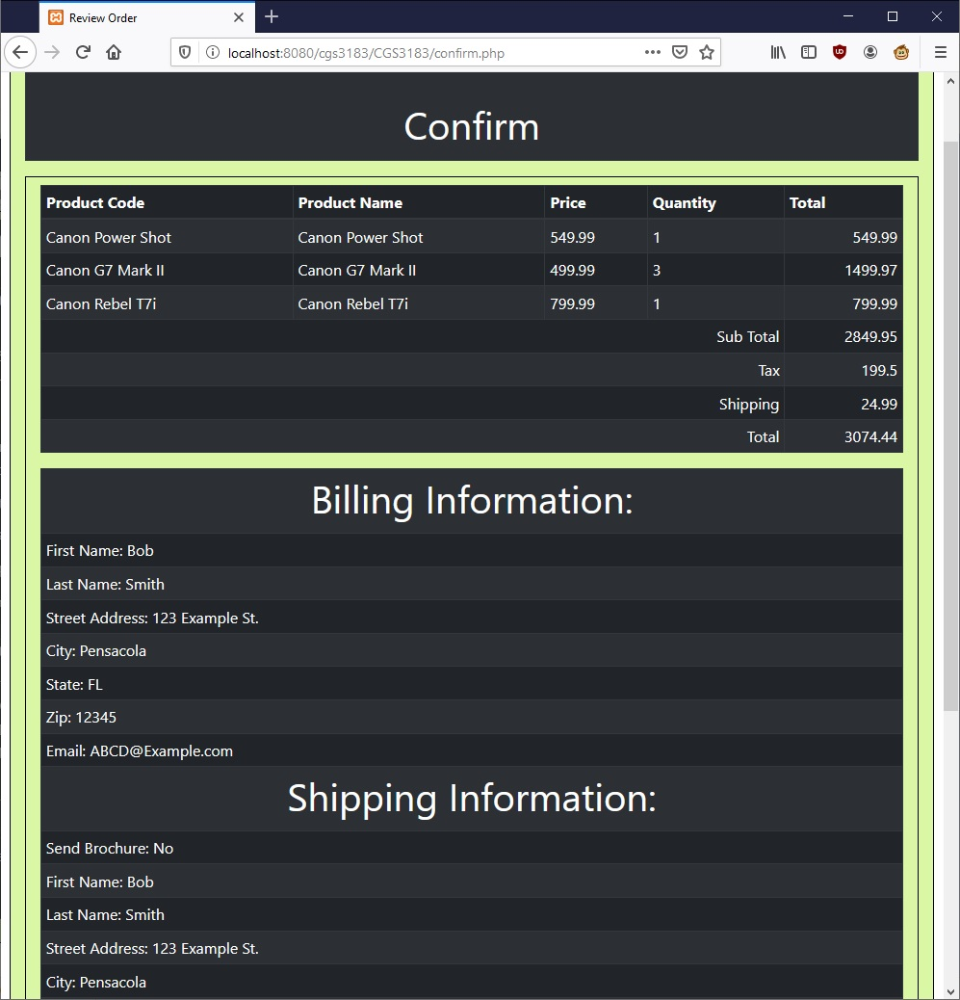

# ShoppingCart
This is a Web-based shopping application using PHP, HTML, CSS. The inventory is located on a local database using XAMPP and can be modified for various products. The application will store customer and transaction information onto the database using SQL commands.

### Product List Page

### Shopping Cart

### Customer Information

### Confirm Page

